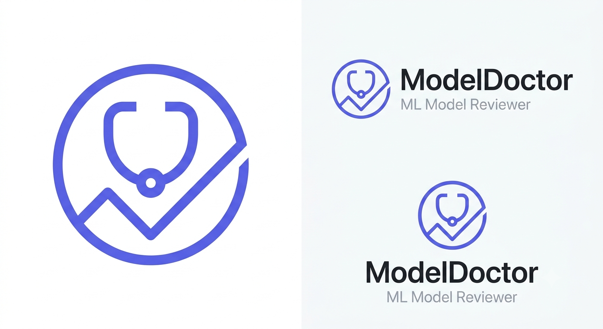
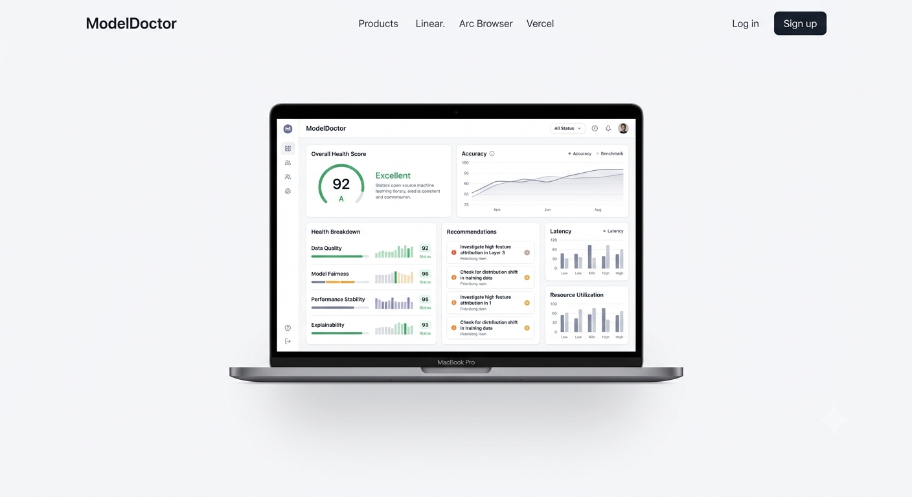
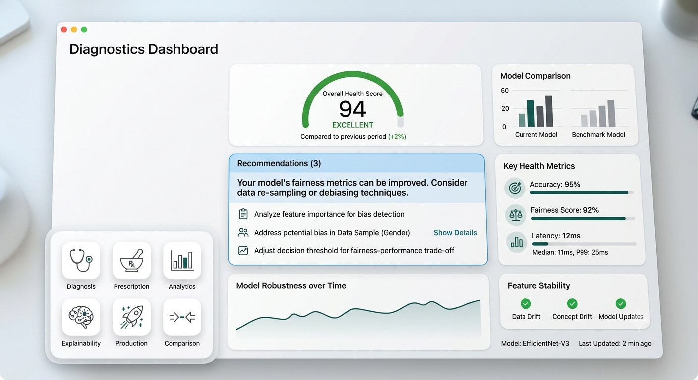
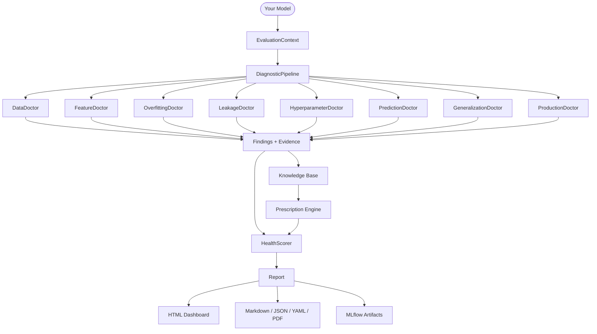
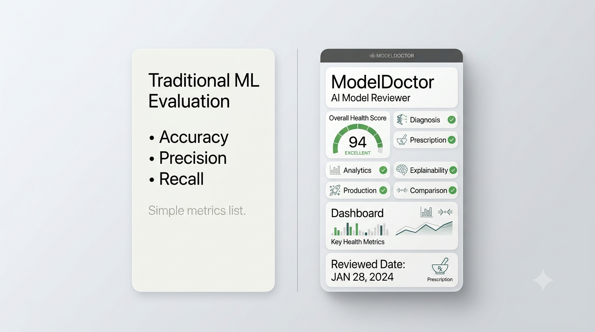
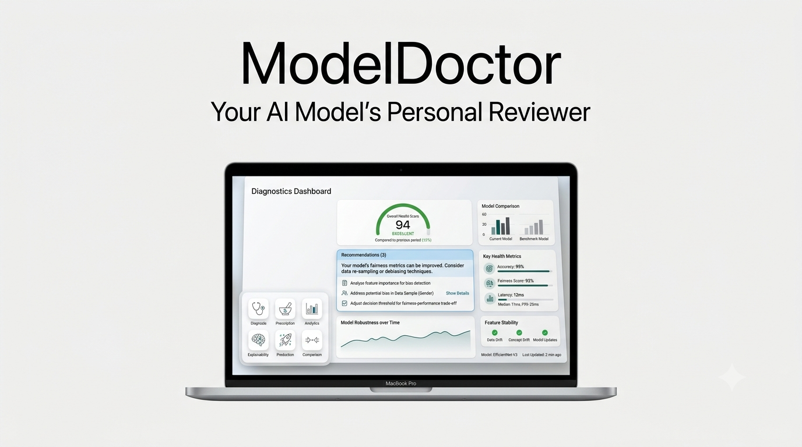

<div align="center">

<!-- Replace with your full logo asset -->


<br />

# ModelDoctor

**Your AI Model's Personal Reviewer.**

ModelDoctor analyzes your machine learning models, diagnoses hidden issues,<br />explains why they occur, and recommends practical improvements.

<br />

[](https://www.python.org)
[](https://pypi.org/project/modeldoctor)
[](https://github.com/modeldoctor/modeldoctor/blob/main/LICENSE)
[](https://pypi.org/project/modeldoctor)
[](https://github.com/modeldoctor/modeldoctor/actions)

</div>

---

<!-- Replace with your hero banner asset (images/banner.png) -->


---

## Quick Start

```bash
pip install modeldoctor
```

```python
import modeldoctor as md

report = md.diagnose(model, X_train, y_train, X_test, y_test)

report.dashboard()   # Opens interactive HTML dashboard
```

That's it. ModelDoctor handles the rest.

<details>
<summary>Install with optional extras</summary>

```bash
# Explainability (SHAP + LIME)
pip install "modeldoctor[explainability]"

# Interactive charts
pip install "modeldoctor[report]"

# AI-powered review summaries (OpenAI / Anthropic)
pip install "modeldoctor[ai]"

# Everything
pip install "modeldoctor[all]"
```

</details>

---

## Why ModelDoctor?

Traditional evaluation gives you numbers. ModelDoctor gives you answers.

| Question | Traditional Tools | ModelDoctor |
|---|---|---|
| What happened? | ✅ Accuracy, F1, AUC | ✅ All standard metrics |
| Is it overfitting? | ❌ Manual inspection | ✅ Automatic diagnosis |
| Is there data leakage? | ❌ Easy to miss | ✅ Leakage Doctor |
| Which features are problematic? | ❌ Requires domain knowledge | ✅ Feature Doctor + SHAP |
| Is it production-ready? | ❌ Not assessed | ✅ Production Doctor |
| How do I fix it? | ❌ Up to you | ✅ Prescription Engine |

A senior ML engineer reviews every model holistically. ModelDoctor does the same — at any scale, on every run.

---

## Dashboard

<!-- Replace with your dashboard screenshot (images/dashboard.png) -->


The interactive HTML dashboard gives you a single view of your model's health.

- **Health Score** — a weighted 0–100 score across all diagnostic dimensions
- **Recommendations** — prioritized, actionable fixes ranked by impact
- **Diagnostic Charts** — overfitting curves, calibration plots, confusion matrices
- **Feature Analysis** — importance rankings and SHAP explainability
- **Calibration** — reliability diagrams and Expected Calibration Error
- **Model Comparison** — side-by-side evaluation of multiple models
- **Pipeline Timing** — per-doctor execution time breakdown
- **Model Passport** — framework, hyperparameters, and dataset snapshot

<!-- Replace with your dashboard closeup screenshot (images/closeup.png) -->


---

## Features

| | Feature | What it does |
|---|---|---|
| 🩺 | **Specialist Doctors** | Eight independent diagnostic modules run in parallel across all key health dimensions |
| 💊 | **Prescription Engine** | YAML-driven rule engine translates findings into ranked, actionable recommendations |
| 🔬 | **Explainability** | SHAP and LIME integration surfaces which features drive model decisions |
| 📐 | **Calibration Analysis** | Reliability diagrams and ECE measure how trustworthy your probability outputs are |
| ⚖️ | **Model Comparison** | Evaluate multiple models side-by-side with unified scoring |
| 📊 | **Interactive Dashboard** | Self-contained HTML report. No server required. |
| ⌨️ | **CLI** | Run full diagnostics from the terminal against any saved model and dataset |
| 🔗 | **MLflow Integration** | Log health scores, findings, and recommendations as MLflow metrics and artifacts |
| 🧩 | **Plugin System** | Register custom Doctors via Python entry points. No core code changes needed. |
| 🪪 | **Model Passport** | Structured snapshot of model class, framework, hyperparameters, and dataset shape |
| 📄 | **Multi-format Reports** | Export to Markdown, JSON, YAML, and PDF |

---

## Example Output

```
╔══════════════════════════════════════════════════════════╗
║              ModelDoctor Diagnostic Report               ║
╚══════════════════════════════════════════════════════════╝

Model      RandomForestClassifier (scikit-learn 1.4.0)
Task       Binary Classification
Dataset    1,000 samples · 20 features

────────────────────────────────────────────────────────────
  HEALTH SCORE    73 / 100    Grade: C+    Status: At Risk
────────────────────────────────────────────────────────────

  Data Quality          ████████░░  82
  Feature Engineering   ██████░░░░  64
  Overfitting Risk      █████░░░░░  51   ← Critical
  Leakage Risk          ████████░░  80
  Prediction Quality    ████████░░  79
  Production Readiness  ████████░░  85

────────────────────────────────────────────────────────────
  FINDINGS
────────────────────────────────────────────────────────────

  [CRITICAL] Severe Overfitting Detected
  Train accuracy: 99.8%  ·  Test accuracy: 76.3%
  Gap of 23.5 pp exceeds threshold of 10 pp.

  [HIGH] Class Imbalance — Minority class at 8.7%
  Model may underperform on minority class in production.

────────────────────────────────────────────────────────────
  TOP RECOMMENDATIONS
────────────────────────────────────────────────────────────

  1. [Critical] Reduce max_depth from 20 → 6–10
     Confidence: High · Estimated improvement: +8–15 pp F1

  2. [High] Apply class_weight='balanced' or SMOTE
     Confidence: High · Estimated improvement: +5–10 pp recall

  3. [Medium] Enable cross-validation (cv=5)
     Confidence: Medium

────────────────────────────────────────────────────────────
  PRODUCTION READINESS    Not recommended for deployment.
────────────────────────────────────────────────────────────
```

---

## Architecture



---

## CLI

```bash
$ doctor diagnose model.pkl dataset.csv --dashboard

  ┌─────────────────────────────────────────────┐
  │       ModelDoctor Diagnostic Run            │
  └─────────────────────────────────────────────┘

  ⠿ Loading data...                      ████████░░  0.3s
  ⠿ Initializing EvaluationContext...    ████████░░  0.1s
  ⠿ Running DiagnosticPipeline...        ████████░░  1.4s
  ⠿ Computing Explainability...          ████████░░  0.8s
  ⠿ Generating Report...                 ████████░░  0.2s

  ✓ Analysis complete. Saved to report.md

  Health Score: 73/100  ·  Grade: C+  ·  8 issues found

  Launching dashboard...
```

```bash
# Additional commands
doctor dashboard report.json   # Open an existing report
doctor compare                 # Run model comparison engine
doctor explain                 # Standalone explainability
doctor passport                # Generate model passport
```

---

## Advanced Features

<details>
<summary><strong>Explainability</strong> — SHAP and LIME integration</summary>

```python
report = md.diagnose(model, X_train, y_train, X_test, y_test)

# Explainability runs automatically when shap/lime are installed.
# Access results directly from the report:
print(report.explainability.top_features)
```

Install: `pip install "modeldoctor[explainability]"`

</details>

<details>
<summary><strong>Calibration</strong> — reliability and ECE</summary>

The `CalibrationDoctor` runs automatically for classifiers with `predict_proba`. It computes the Expected Calibration Error (ECE) and generates reliability diagrams, highlighting whether your model's confidence scores can be trusted.

</details>

<details>
<summary><strong>Model Comparison</strong> — side-by-side evaluation</summary>

```python
from modeldoctor import ModelDoctorConfig

config = ModelDoctorConfig(compare_models=True)
report = md.diagnose(model, X_train, y_train, X_test, y_test, config=config)
```

<!-- Replace with your comparison screenshot (images/comparison.png) -->


</details>

<details>
<summary><strong>MLflow Integration</strong> — track diagnostics alongside experiments</summary>

```python
from modeldoctor.integrations.mlflow import log_report_to_mlflow

report = md.diagnose(model, X_train, y_train, X_test, y_test)
log_report_to_mlflow(report)
# Logs: health score, per-dimension scores, findings count, recommendations
```

</details>

<details>
<summary><strong>Custom Doctors</strong> — extend the plugin system</summary>

```python
from modeldoctor import BaseDoctor, EvaluationContext
from modeldoctor.models.diagnosis import Diagnosis
from modeldoctor.models.enums import Severity

class MyCustomDoctor(BaseDoctor):
    name      = "my_custom"
    dimension = "Custom Dimension"
    priority  = 90

    def examine(self, context: EvaluationContext) -> Diagnosis:
        diagnosis = self._new_diagnosis()

        if some_condition(context):
            diagnosis.add_finding(
                self._finding(
                    title="Something needs attention",
                    severity=Severity.WARNING,
                    explanation="Details here.",
                )
            )

        diagnosis.dimension_score = self._score_from_findings(diagnosis)
        return diagnosis
```

Register via `pyproject.toml`:

```toml
[project.entry-points."modeldoctor.doctors"]
my_custom = "my_package.doctors:MyCustomDoctor"
```

</details>

<details>
<summary><strong>Report Serialization</strong> — export to any format</summary>

```python
# Markdown
report.save_markdown("report.md")

# JSON
report.save_json("report.json")

# YAML
report.save_yaml("report.yaml")

# PDF  (requires modeldoctor[report])
report.save_pdf("report.pdf")
```

</details>

---

## Examples

<!-- TODO: Add links to example notebooks and scripts as they are added to the repository -->

| Example | Description |
|---|---|
| [`examples/classification_example.py`](examples/classification_example.py) | Binary classification with RandomForest |
| `examples/regression_example.py` | *(coming soon)* |
| `examples/mlflow_integration.py` | *(coming soon)* |
| `examples/custom_doctor.py` | *(coming soon)* |

---

## Documentation

<!-- TODO: Update links once documentation site is live -->

| | |
|---|---|
| [Getting Started](https://modeldoctor.readthedocs.io/getting-started) | Install and run your first diagnostic |
| [Dashboard Guide](https://modeldoctor.readthedocs.io/dashboard) | Understanding the interactive dashboard |
| [CLI Reference](https://modeldoctor.readthedocs.io/cli) | Full command reference |
| [Plugin System](https://modeldoctor.readthedocs.io/plugins) | Writing and registering custom Doctors |
| [API Reference](https://modeldoctor.readthedocs.io/api) | Full Python API documentation |
| [Contributing](https://modeldoctor.readthedocs.io/contributing) | How to contribute |

---

## Roadmap

**Current — v0.2**
- Eight built-in diagnostic doctors
- Prescription Engine with YAML rules
- Interactive HTML dashboard
- Explainability (SHAP + LIME)
- MLflow integration
- CLI
- Plugin system via entry points
- Model Passport
- Markdown, JSON, YAML, and PDF reports

**Planned — v0.3+**
- [ ] PyTorch and TensorFlow support
- [ ] Regression and multiclass dashboards
- [ ] Time-series diagnostics
- [ ] Drift detection and monitoring hooks
- [ ] LLM-powered prescription narratives
- [ ] VS Code extension
- [ ] Pre-commit hook integration

---

## Contributing

Contributions are welcome.

1. Fork the repository and create a branch from `main`.
2. Install dev dependencies: `pip install -e ".[dev]"`
3. Run tests: `pytest`
4. Open a pull request with a clear description of the change.

All contributions must include tests and pass the full CI suite. See [`CHANGELOG.md`](CHANGELOG.md) for what is in progress.

For larger changes, please open an issue first to discuss the approach.

---

## License

MIT — see [`LICENSE`](LICENSE) for details.

---

<div align="center">

<!-- Replace with your social media banner asset (images/smediabanner.png) -->


<br />
<br />

Built for ML engineers who care about shipping models that actually work.

</div>
