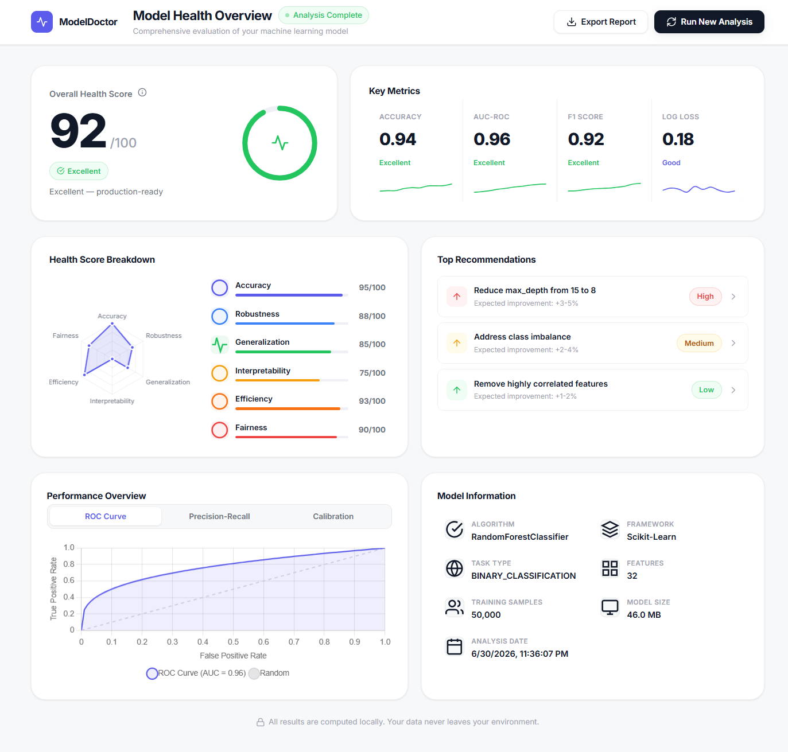
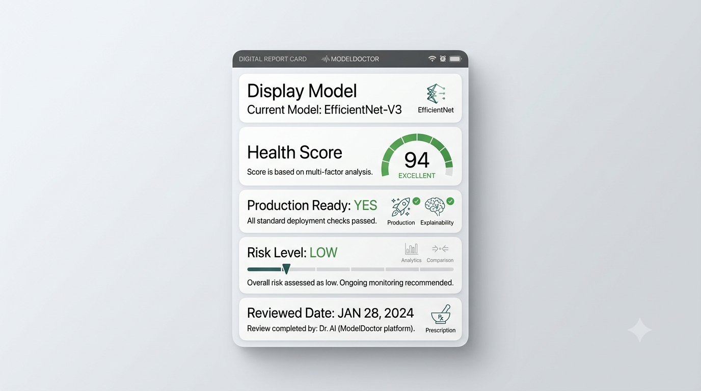
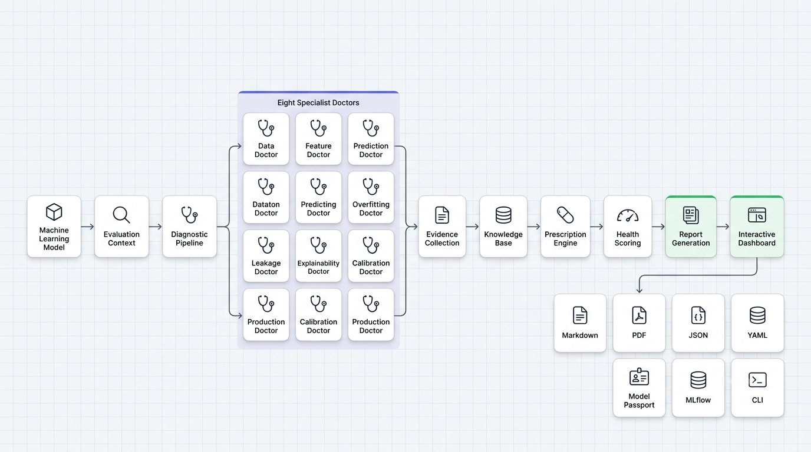

<div align="center">


**Diagnose your machine learning models like a senior ML engineer.**

[](https://pypi.org/project/modeldoctor/)
[](https://www.python.org/)
[](https://github.com/CodexUjayer/Model-Doctor/blob/main/LICENSE)
[](https://pypi.org/project/modeldoctor/)
[](https://codexujayer.github.io/Model-Doctor/)
[](https://github.com/CodexUjayer/Model-Doctor/releases)
[](https://github.com/CodexUjayer/Model-Doctor/issues)
[](https://github.com/CodexUjayer/Model-Doctor/stargazers)

</div>

<br />

<div align="center">
  
</div>

## Why ModelDoctor?

Traditional machine learning evaluation focuses almost entirely on aggregate metrics like accuracy, precision, and recall. While these numbers indicate how well a model performs on a specific dataset, they rarely explain *why* it behaves that way or whether the model will actually survive in a production environment. 

ModelDoctor evaluates models holistically. It runs a comprehensive suite of diagnostic checks to identify hidden problems—from subtle data leakage and overfitting to calibration errors and inference latency. 

Instead of leaving you to interpret raw numbers, ModelDoctor explains what issues exist, why they are problematic, and exactly how to fix them before deployment.

## Quick Example

```python
import modeldoctor as md

report = md.diagnose(
    model,
    X_train,
    y_train,
    X_test,
    y_test,
)

report.show()
```



## Installation

Install the core library:

```bash
pip install modeldoctor
```

You can optionally install extensions for specific features:

```bash
pip install modeldoctor[dashboard]
pip install modeldoctor[shap]
pip install modeldoctor[all]
```

## Features

### Diagnostics
- Overfitting
- Data Leakage
- Calibration
- Prediction Quality
- Feature Analysis
- Data Quality
- Generalization
- Production Readiness

### Reporting
- HTML Dashboard
- Markdown
- JSON
- PDF
- CLI
- MLflow

### Explainability
- SHAP
- Feature Importance
- Evidence Engine
- Confidence Engine
- Prescription Engine

## Example Output

**Overall Health**: 82/100 (Needs Review)

**Diagnosis**: Potential Data Leakage Detected (Critical)
The top feature `customer_id` accounts for 98% of the total feature importance and has a nearly perfect correlation (0.99) with the target variable.

**Prescription**: Remove `customer_id` from the training dataset.

**Recommendation**: Retrain the model and ensure no future information or unique identifiers are included in the feature set.

## Architecture

<div align="center">
  
</div>

The evaluation process begins by wrapping your model and dataset into an `EvaluationContext`, computing metrics lazily only as needed. Specialized `Doctors` then analyze this context across different dimensions, extracting concrete `Evidence`. The `Confidence` and `Risk` engines synthesize this evidence into prioritized `Prescriptions`, ultimately rendering them into a standardized `Report`.

## Validation

ModelDoctor is continuously verified against the Validation Laboratory, an independent framework designed to stress-test the diagnostic engine across real-world edge cases. 

| Metric | Result |
|---|---|
| Validation Scenarios | 54 |
| Diagnostic Accuracy | 98.1% |
| Supported Models | Scikit-learn |
| Validation Framework | Included |

## Dashboard

<div align="center">
  
</div>

The HTML dashboard provides an interactive interface to explore your model's health score, drill down into specific diagnostic charts, and review prioritized recommendations. The report is fully self-contained, searchable, and easy to export and share with stakeholders.

## Documentation

- [Installation](docs/getting-started/installation.md)
- [Quick Start](docs/getting-started/quickstart.md)
- [API Reference](docs/api/reference.md)
- [Dashboard Guide](docs/getting-started/dashboard.md)
- [Validation Laboratory](docs/validation/README.md)
- [Examples](docs/examples/basic.md)

## Examples

- [`classification.py`](examples/classification.py) — Diagnose a standard binary classifier.
- [`regression.py`](examples/regression.py) — Evaluate a regressor's prediction quality.
- [`dashboard.py`](examples/dashboard.py) — Generate and serve an interactive HTML dashboard.
- [`html_report.py`](examples/html_report.py) — Export static reports for CI/CD pipelines.
- [`custom_doctor.py`](examples/custom_doctor.py) — Build and register a custom diagnostic rule.

## Roadmap

- [x] Core diagnostics
- [x] Validation laboratory
- [x] Dashboard
- [ ] CLI
- [ ] MLflow integration
- [ ] Regression support enhancements

**Future**
- PyTorch support
- TensorFlow support
- CatBoost enhancements

## Contributing

Contributions are welcome. Please refer to our [CONTRIBUTING.md](docs/contributing.md) for details.

1. Fork the repository
2. Create a feature branch
3. Commit your changes
4. Open a Pull Request

## Citation

If you use ModelDoctor in academic research, please cite it:

```bibtex
@software{modeldoctor,
  title = {ModelDoctor: Clinical Diagnostics for Machine Learning Models},
  author = {ModelDoctor Contributors},
  year = {2026},
  url = {https://github.com/modeldoctor/modeldoctor}
}
```

## Security

Please report security vulnerabilities according to the guidelines in [SECURITY.md](SECURITY.md).

Do **not** report security vulnerabilities through public GitHub Issues.

## License

This project is licensed under the [MIT License](LICENSE).

---

Built by the ModelDoctor community.
